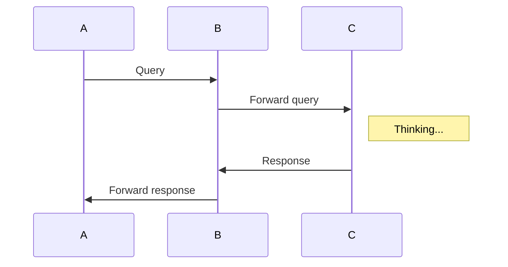

# teadown features


## toc

```
[[toc]]
```

[[toc]]

## footnote

Here is a footnote reference,[^1] and another.[^longnote]

[^1]: Here is the footnote.

[^longnote]: Here's one with multiple blocks.

    Subsequent paragraphs are indented to show that they
belong to the previous footnote.


## memaid chart

> code block with language of mermaid




## Baidu echarts

> code block with language of echarts

```echarts
{
    title: {
        text: 'ECharts Sample'
    },
    tooltip: {},
    legend: {
        data:['销量']
    },
    xAxis: {
        data: ["衬衫","羊毛衫","雪纺衫","裤子","高跟鞋","袜子"]
    },
    yAxis: {},
    series: [{
        name: '销量',
        type: 'bar',
        data: [5, 20, 36, 10, 10, 20]
    }]
}
```

```echarts
{
    title : {
        text: '南丁格尔玫瑰图2',
        subtext: '纯属虚构',
        x:'center'
    },
    tooltip : {
        trigger: 'item',
        formatter: "{a} <br/>{b} : {c} ({d}%)"
    },
    legend: {
        x : 'center',
        y : 'bottom',
        data:['rose1','rose2','rose3','rose4','rose5','rose6','rose7','rose8']
    },
    toolbox: {
        show : true,
        feature : {
            mark : {show: true},
            dataView : {
                show: true, readOnly: false
                
            },
            magicType : {
                show: true,
                type: ['pie', 'funnel']
            },
            restore : {show: true},
            saveAsImage : {show: true}
        }
    },
    calculable : true,
    series : [
        {
            name:'半径模式',
            type:'pie',
            radius : [20, 110],
            center : ['25%', '50%'],
            roseType : 'radius',
            label: {
                normal: {
                    show: false
                },
                emphasis: {
                    show: true
                }
            },
            lableLine: {
                normal: {
                    show: false
                },
                emphasis: {
                    show: true
                }
            },
            data:[
                {value:10, name:'rose1'},
                {value:5, name:'rose2'},
                {value:15, name:'rose3'},
                {value:25, name:'rose4'},
                {value:20, name:'rose5'},
                {value:35, name:'rose6'},
                {value:30, name:'rose7'},
                {value:40, name:'rose8'}
            ]
        },
        {
            name:'面积模式',
            type:'pie',
            radius : [30, 110],
            center : ['75%', '50%'],
            roseType : 'area',
            data:[
                {value:10, name:'rose1'},
                {value:5, name:'rose2'},
                {value:15, name:'rose3'},
                {value:25, name:'rose4'},
                {value:20, name:'rose5'},
                {value:35, name:'rose6'},
                {value:30, name:'rose7'},
                {value:40, name:'rose8'}
            ]
        }
    ]
}
```


## emoji

> begin with colon and end width colon.

```
:person_with_blond_hair:
```
:person_with_blond_hair:
:man_with_gua_pi_mao::man_with_turban::construction_worker:
:cop::angel::princess::smiley_cat::heart_eyes_cat:

## KaTeX

> `$...$`

```
$f(x) = \int_{-\infty}^\infty
    \hat f(\xi)\,e^{2 \pi i \xi x}
    \,d\xi$
```

$f(x) = \int_{-\infty}^\infty
    \hat f(\xi)\,e^{2 \pi i \xi x}
    \,d\xi$


## code highlight

```js
var x = 1;
```