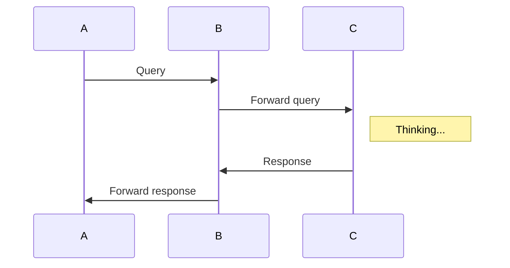

# teadown 特性

## toc

```
[toc]
```

[[toc]]

## footnote

Here is a footnote reference,[^1] and another.[^longnote]

[^1]: Here is the footnote.

[^longnote]: Here's one with multiple blocks.

    Subsequent paragraphs are indented to show that they
belong to the previous footnote.


## memaid 图

> code 模块，语言为 mermaid

```(mermaid)
sequenceDiagram
A->> B: Query
B->> C: Forward query
Note right of C: Thinking...
C->> B: Response
B->> A: Forward response
```



## 流程图

> code 模块，语言为 sequence

```(sequence)
A->B: Normal line
B-->C: Dashed line
C->>D: Open arrow
D-->>A: Dashed open arrow
```

```sequence
A->B: Normal line
B-->C: Dashed line
C->>D: Open arrow
D-->>A: Dashed open arrow
```

## emoji

> 前后各一个冒号

```
:person_with_blond_hair:
```
:person_with_blond_hair::man_with_gua_pi_mao::man_with_turban::construction_worker::cop::angel::princess::smiley_cat::smile_cat::heart_eyes_cat:

## KaTeX

> 夹在 $ 中间

```
$f(x) = \int_{-\infty}^\infty
    \hat f(\xi)\,e^{2 \pi i \xi x}
    \,d\xi$
```

$f(x) = \int_{-\infty}^\infty
    \hat f(\xi)\,e^{2 \pi i \xi x}
    \,d\xi$


## code

```js
var x = 1;
```